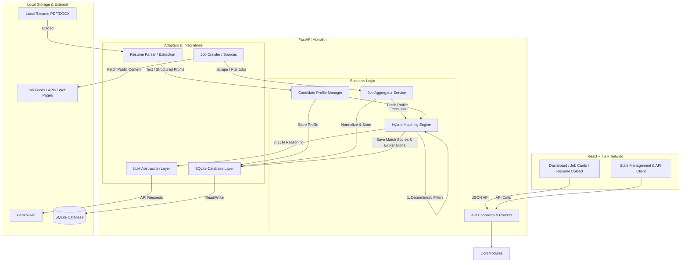

# JobHunter AI — System Architecture (V1)

This document details the system architecture for **JobHunter AI**, a local-first, AI-powered job discovery and matching application. JobHunter AI is designed as a **modular monolith** that runs locally on the user's computer, prioritizing data privacy, code simplicity, extensibility, and preparation for a future multi-agent framework.

---

## 1. System Overview

JobHunter AI helps candidates find relevant job openings and matches them intelligently to their resumes. It parses resume files, compiles a structured profile, pulls job listings from configured compliant sources, filters and matches them using a hybrid algorithm, and presents recommendations on a dashboard.

### Key Architectural Guidelines
- **Local-First**: The application database (SQLite) and business logic run on the user's machine.
- **Privacy-Centric**: Candidate resumes and structured profiles are stored locally. Outbound connections are limited to job fetching and LLM analysis (Gemini).
- **No Agentic Loop in V1**: Services are standard procedural modules with clean interfaces, ensuring deterministic reliability before introducing autonomous agents.
- **Modular Monolith**: Code is logically partitioned by domain, avoiding microservice network overhead.

---

## 2. Component Architecture & Diagram

The diagram below illustrates the components and their data flows:



### Component Responsibilities

| Component | Responsibility | Technical Stack |
| :--- | :--- | :--- |
| **Frontend UI** | Renders dashboard, resume uploader, profile editor, job feed, match breakdowns, and config settings. | React, TypeScript, Tailwind CSS, Lucide React, Motion |
| **Backend API** | Handles incoming REST requests, routing, file upload, and schema validation. | FastAPI, Uvicorn, Pydantic |
| **Resume Parser** | Reads local PDF/DOCX files, extracts text, and uses the LLM Service to structure the candidate profile. | PyPDF2/pdfplumber, docx2txt, Gemini |
| **Job Scraper** | Crawls allowed public pages or reads structured JSON/XML feeds. Uses factory pattern for adding sources. | Playwright Python (async), HTTPX |
| **Job Aggregator** | Coordinates scraping jobs, parses their details, normalizes schemas, and deduplicates listings. | Python standard library |
| **Matching Engine** | Executes deterministic rules followed by AI semantic analysis. Calculates a score (0-100) and structured reasoning. | SQLite (FTS5), Python, Gemini |
| **LLM Client** | Standardized interface for querying LLM models. Wraps SDK to enable changing providers/models. | `google-genai` SDK |
| **DB Client (ORM)** | Interacts with the local database, manages schemas, queries, and writes. | SQLite, SQLAlchemy / SQLModel |

---

## 3. Data Flow

### A. Resume Upload and Profile Structuring
1. The user uploads a resume (`.pdf` or `.docx`) in the frontend.
2. FastAPI saves the file temporarily in a secure local cache.
3. The **Resume Parser** reads the file and extracts raw text.
4. The text is passed to the **LLM Client** with a system prompt detailing the versioned **Candidate Profile Schema**.
5. Gemini returns structured JSON matching the schema.
6. The user reviews, edits, and saves the structured profile in the UI.
7. The **Profile Manager** writes the profile to SQLite.

### B. Job Fetching and Deduplication
1. A manual trigger or background timer calls the **Job Aggregator**.
2. The Aggregator queries the **Job Scraper** for registered job sources.
3. Each source returns raw listings. The Aggregator normalizes them to the **Job Schema**.
4. The Aggregator runs **Deduplication**:
   - Strict Check: If a duplicate `application_url` or `source_job_id` exists, discard it.
   - Fuzzy Check: If a job has the exact same `title`, `company`, and `location`, discard it.
5. Deduplicated jobs are saved to SQLite.

### C. Matching and Suitability Scoring
1. The user initiates a matching run (or it triggers automatically for newly collected jobs).
2. The **Matching Engine** loads the Candidate Profile and the selected Job Listings.
3. **Stage 1 (Deterministic)**: Compares hard filters (e.g., Remote preference, Location bounds, Minimum Experience Level). If a job fails a critical preference (e.g. user demands remote, job is strictly onsite), its score is capped or flagged.
4. **Stage 2 (Keyword Match)**: Uses SQLite Full-Text Search (FTS5) or basic keyword scanning to count skill overlaps.
5. **Stage 3 (LLM Analysis)**: For jobs that pass initial filters, the engine calls Gemini with a payload containing the Profile (skills, experience) and the Job (description, requirements).
6. Gemini outputs:
   - Overall Match Score (0–100) based on weighted parameters.
   - Matches: List of shared skills, qualifications, or requirements met.
   - Missing: List of skills or requirements not present in the profile.
   - Concerns: Qualitative warnings (e.g., job requires 5 years of experience, candidate has 2; or domain mismatch).
7. Results are saved in the `matches` table and loaded on the user dashboard.

---

## 4. Domain Schemas

### Candidate Profile Schema (JSON Version 1.0)
```json
{
  "$schema": "http://json-schema.org/draft-07/schema#",
  "title": "CandidateProfile",
  "type": "object",
  "properties": {
    "version": { "type": "string", "const": "1.0" },
    "personal_info": {
      "type": "object",
      "properties": {
        "name": { "type": "string" },
        "email": { "type": "string", "format": "email" },
        "phone": { "type": "string" },
        "location": { "type": "string" }
      },
      "required": ["name"]
    },
    "preferences": {
      "type": "object",
      "properties": {
        "preferred_roles": { "type": "array", "items": { "type": "string" } },
        "preferred_locations": { "type": "array", "items": { "type": "string" } },
        "remote_preference": { "type": "string", "enum": ["remote", "hybrid", "onsite", "any"] },
        "minimum_salary": { "type": "number" },
        "experience_level": { "type": "string", "enum": ["intern", "entry", "mid", "senior", "lead", "executive"] }
      }
    },
    "education": {
      "type": "array",
      "items": {
        "type": "object",
        "properties": {
          "institution": { "type": "string" },
          "degree": { "type": "string" },
          "field_of_study": { "type": "string" },
          "graduation_year": { "type": "integer" }
        }
      }
    },
    "skills": {
      "type": "object",
      "properties": {
        "programming_languages": { "type": "array", "items": { "type": "string" } },
        "frameworks": { "type": "array", "items": { "type": "string" } },
        "databases": { "type": "array", "items": { "type": "string" } },
        "cloud_technologies": { "type": "array", "items": { "type": "string" } },
        "tools_and_others": { "type": "array", "items": { "type": "string" } }
      }
    },
    "experience": {
      "type": "array",
      "items": {
        "type": "object",
        "properties": {
          "company": { "type": "string" },
          "role": { "type": "string" },
          "start_date": { "type": "string" },
          "end_date": { "type": "string" },
          "description": { "type": "string" },
          "technologies": { "type": "array", "items": { "type": "string" } },
          "is_internship": { "type": "boolean" }
        }
      }
    },
    "certifications": {
      "type": "array",
      "items": { "type": "string" }
    },
    "projects": {
      "type": "array",
      "items": {
        "type": "object",
        "properties": {
          "name": { "type": "string" },
          "description": { "type": "string" },
          "technologies": { "type": "array", "items": { "type": "string" } },
          "url": { "type": "string" }
        }
      }
    }
  },
  "required": ["version", "personal_info", "preferences", "skills"]
}
```

### Job Schema (Normalized)
```json
{
  "$schema": "http://json-schema.org/draft-07/schema#",
  "title": "NormalizedJob",
  "type": "object",
  "properties": {
    "job_id": { "type": "string", "description": "UUID generated by local database" },
    "source": { "type": "string", "description": "e.g., adzuna, careers_page" },
    "source_job_id": { "type": "string", "description": "Identifier from the source platform" },
    "title": { "type": "string" },
    "company": { "type": "string" },
    "location": { "type": "string" },
    "remote_status": { "type": "string", "enum": ["remote", "hybrid", "onsite", "unspecified"] },
    "description": { "type": "string" },
    "requirements": { "type": "array", "items": { "type": "string" } },
    "preferred_qualifications": { "type": "array", "items": { "type": "string" } },
    "skills": { "type": "array", "items": { "type": "string" } },
    "experience_required": { "type": "number", "description": "Years of experience required" },
    "employment_type": { "type": "string", "enum": ["full-time", "part-time", "contract", "internship", "unspecified"] },
    "salary": {
      "type": "object",
      "properties": {
        "min": { "type": "number" },
        "max": { "type": "number" },
        "currency": { "type": "string" },
        "interval": { "type": "string", "enum": ["hourly", "monthly", "yearly"] }
      }
    },
    "posted_date": { "type": "string", "format": "date-time" },
    "application_url": { "type": "string" },
    "collected_at": { "type": "string", "format": "date-time" }
  },
  "required": ["job_id", "source", "title", "company", "location", "description", "application_url", "collected_at"]
}
```

---

## 5. Subsystem Details

### A. SQLite Database Schema
The database uses a light schema suited for local storage.

1. **`candidate_profiles`**: Stores profile revisions.
   - `id` (INTEGER PK AUTOINCREMENT)
   - `version` (TEXT)
   - `personal_info` (JSON Text)
   - `preferences` (JSON Text)
   - `skills` (JSON Text)
   - `education` (JSON Text)
   - `experience` (JSON Text)
   - `certifications` (JSON Text)
   - `projects` (JSON Text)
   - `created_at` (DATETIME)
   - `is_active` (BOOLEAN)

2. **`jobs`**: Stores normalized job postings.
   - `job_id` (TEXT PK)
   - `source` (TEXT)
   - `source_job_id` (TEXT)
   - `title` (TEXT)
   - `company` (TEXT)
   - `location` (TEXT)
   - `remote_status` (TEXT)
   - `description` (TEXT)
   - `requirements` (JSON Text)
   - `skills` (JSON Text)
   - `experience_required` (REAL)
   - `employment_type` (TEXT)
   - `salary_min` (REAL), `salary_max` (REAL), `salary_currency` (TEXT)
   - `posted_date` (DATETIME)
   - `application_url` (TEXT)
   - `collected_at` (DATETIME)

3. **`match_result`**: Links a profile revision to a specific job listing with scores.
   - `match_id` (TEXT PK)
   - `candidate_profile_id` (TEXT FK)
   - `job_id` (TEXT FK)
   - `overall_score` (REAL)
   - `recommendation` (TEXT)
   - `skill_score` (REAL)
   - `experience_score` (REAL)
   - `education_score` (REAL)
   - `role_score` (REAL)
   - `location_score` (REAL)
   - `required_qualification_score` (REAL)
   - `preferred_qualification_score` (REAL)
   - `matching_skills` (JSON Text)
   - `missing_required_skills` (JSON Text)
   - `missing_preferred_skills` (JSON Text)
   - `experience_gap` (REAL)
   - `concerns` (JSON Text)
   - `explanation` (TEXT)
   - `confidence` (REAL)
   - `engine_version` (TEXT)
   - `created_at` (DATETIME)
   - `updated_at` (DATETIME)
   - *Has a composite unique index constraint on `(candidate_profile_id, job_id)` to support overwrites.*

---

### B. Job-Source Extensibility
To crawl jobs without violating robot/access policies:
- We establish a standard interface `BaseJobSource`:
  ```python
  class BaseJobSource(ABC):
      @abstractmethod
      async def search_jobs(self, query: str, location: str) -> List[Dict]:
          """Fetches raw jobs and returns them as normalized dicts."""
          pass
  ```
- Sources are structured using the factory design:
  1. **AdzunaSource**: Querying the Adzuna API (with rate limits, connections, connect/read timeouts).
  2. **RemoteOKSource**: public RSS/JSON feed fetcher (no keys, includes User-Agent overrides, connection and read timeouts).

---

### C. Hybrid Matching System
Matching avoids 100% dependency on LLMs by breaking calculation into two distinct layers:

1. **Deterministic Scoring Layer (100 Points Overall)**
   - **Skills Compatibility (35 points)**: Normalized overlap ratio of candidate skills vs job requirements.
   - **Experience Compatibility (20 points)**: Compares years of experience. Deducts 4 points per year of gap. Gaps $\ge 4$ years cap the overall score at 40 (severe mismatch).
   - **Role Title Alignment (15 points)**: Evaluates preferred roles against job title using edit distance and token overlaps.
   - **Location & Remote Fit (15 points)**: Distinguishes strict Remote preference (mismatch with onsite is set to 0), preferred Remote (deducts 7 points for hybrid onsite), and unspecified location targets (gives full 15 points).
   - **Education Alignment (10 points)**: Checks degree levels (BSc, MSc, PhD) and technical field overlap (Computer Science, Software Eng, etc.).
   - **Qualification Compliance (5 points)**: Checks required vs preferred compliance. Deducts 5 points if required parameters are missing; deducts 1.0 point per preferred skill gap (capped at 2.0 minimum).

2. **AI Reasoning Layer (Selective Gemini Trigger)**
   - Gemini semantic reviews are triggered **only on ambiguity signals**:
     * Unclear required vs preferred qualifications in description context.
     * Ambiguous role/title equivalence (fuzzy Levenshtein ratio between 0.35 and 0.79).
     * Ambiguous experience wording (e.g. "proven industry background").
     * Ambiguous education equivalence (related science degrees).
   - If triggered, Gemini adjusts the role title alignment score and appends semantic concerns.
   - If disabled, key missing, or timed out, the system falls back gracefully to pure deterministic calculations.


#### Configurable Weights Formula:
$$\text{Score} = (W_{location} \times S_{location}) + (W_{experience} \times S_{experience}) + (W_{skills\_det} \times S_{skills\_det}) + (W_{semantic} \times S_{semantic})$$
Users can configure these weights in the UI dashboard.

---

### D. LLM Service Abstraction
We define `BaseLLMClient`:
```python
class BaseLLMClient(ABC):
    @abstractmethod
    async def extract_structured_profile(self, resume_text: str) -> Dict:
        pass
        
    @abstractmethod
    async def evaluate_match(self, profile: Dict, job: Dict) -> Dict:
        pass
```
We provide `GeminiClient` implementing this interface using Google's `google-genai` SDK. Switching to local LLMs (e.g., Ollama/Llama-3) in the future requires only implementing `OllamaClient` without changing the matching engine or router logic.

---

## 6. Security & Privacy

1. **Local Storage**: All databases and files remain in the user's home directory.
2. **API Keys**: Stored in a local `.env` file, loaded via python-dotenv. Never committed to source control.
3. **External Requests**:
   - Resume content is transmitted to the LLM Provider (Google Gemini API). This is clearly flagged in the UI.
   - Job boards are queried using generic search parameters (e.g., "Python Developer", "Boston"), keeping candidate identities anonymous.
4. **Temporary Files**: Resumes uploaded through the API are read into memory or stored in a temporary scratch space, then immediately deleted after structuring.

---

## 7. Evolution to Multi-Agent Architecture (V2)

The modular design easily maps to an agent framework in the future. The modules defined in V1 will map to agents as follows:

```
        V1 Modular Monolith                          V2 Multi-Agent System
+---------------------------------+          +---------------------------------+
| Resume Parser Module            |  ====>   | Resume Agent                    |
| (Structured Extraction)         |          | (Polishes & customizes profiles)|
+---------------------------------+          +---------------------------------+
| Job Scraper & Aggregator        |  ====>   | Job Search & Extraction Agents  |
| (Playwright / API fetch)        |          | (Discovers & extracts positions)|
+---------------------------------+          +---------------------------------+
| Hybrid Matching Engine          |  ====>   | Matching Agent                  |
| (Deterministic + LLM reasoning) |          | (Calculates fit & compatibility)|
+---------------------------------+          +---------------------------------+
| (None - V1 is Match-Only)       |  ====>   | Application Agent               |
|                                 |          | (Auto-drafts cover letters)     |
+---------------------------------+          +---------------------------------+
| (None - V1 is Match-Only)       |  ====>   | Orchestrator Agent              |
|                                 |          | (Coordinates task sequences)    |
+---------------------------------+          +---------------------------------+
```

By decoupling API endpoints, database operations, and services, each module can be wrapped inside an Agent Executor (e.g. using LangGraph or CrewAI tools) without modifying their internal business rules.
